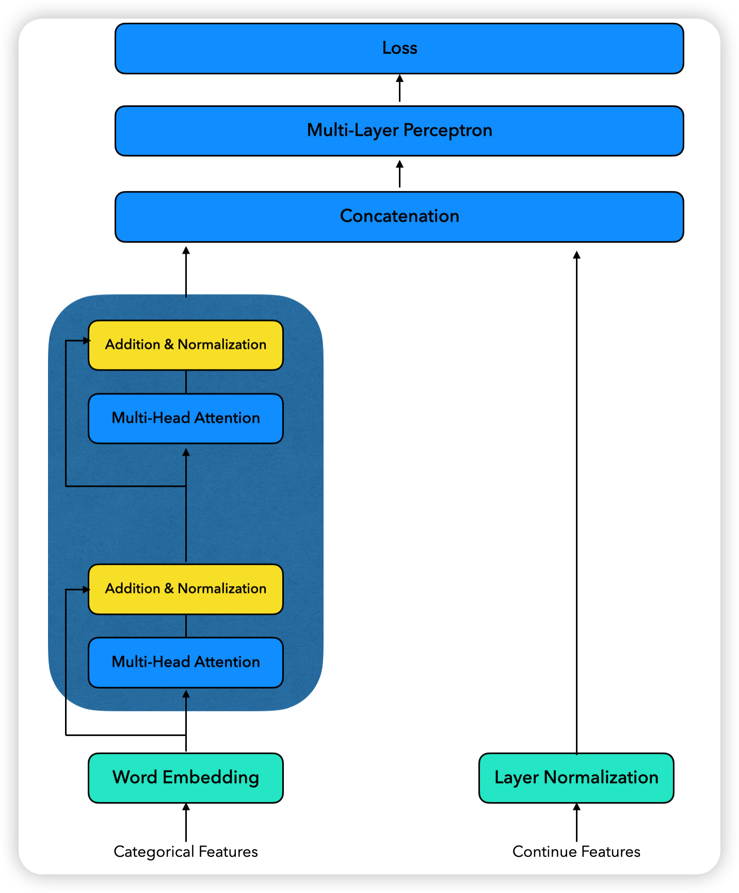
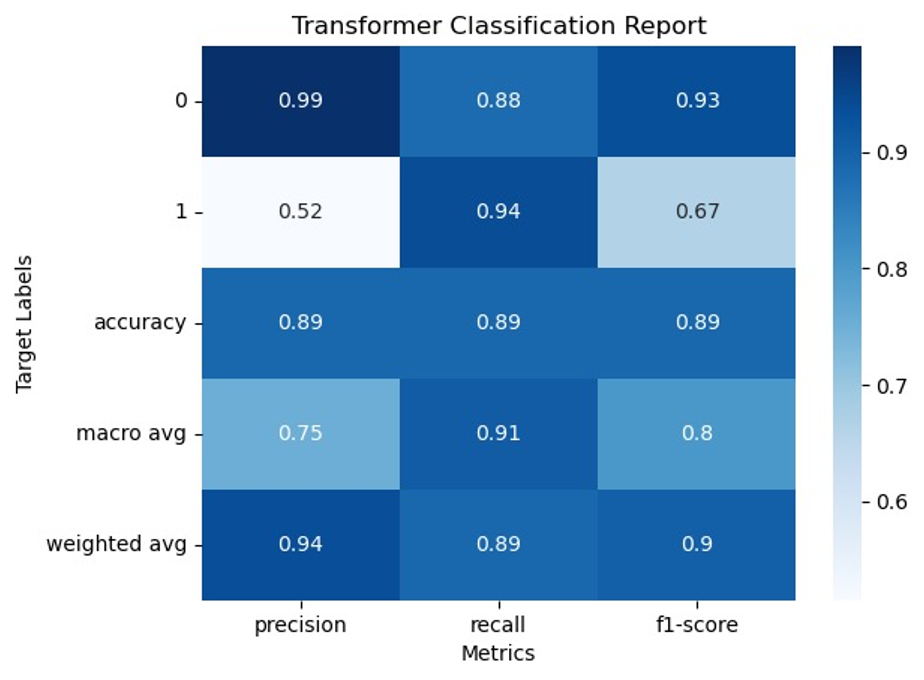

### Data set format
* the Bank Marketing data set train set(from May 2008 to November 2010) , test set 10% of the examples (4521) randomly selected
### 
| age | job         | marital  | education | default | balance | housing | loan | contact  | day | month | duration | campaign | pdays | previous | poutcome | y   |
|-----|-------------|----------|-----------|---------|---------|---------|------|----------|-----|-------|----------|----------|-------|----------|----------|-----|
| 42  | technician  | divorced | secondary | no      | -78     | yes     | yes  | cellular | 29  | jul   | 10       | 23       | -1    | 0        | unknown  | no  |
* Definition of each element
* 
| #   | Feature     | Description                                                                                      | Type    |
| --- | ----------- | ------------------------------------------------------------------------------------------------ | ------- |
| 1   | age         | Numeric: Age of the client.                                                                      | Numeric |
| 2   | job         | Categorical: Type of job. Possible values: "admin.","unknown","unemployed",...                      | String  |
| 3   | marital     | Categorical: Marital status. Possible values: "married","divorced","single".                        | String  |
| 4   | education   | Categorical: Education level. Possible values: "unknown","secondary","primary","tertiary".         | String  |
| 5   | default     | Binary: Has credit in default? Possible values: "yes","no".                                        | String  |
| 6   | balance     | Numeric: Average yearly balance, in euros.                                                        | Numeric |
| 7   | housing     | Binary: Has housing loan? Possible values: "yes","no".                                            | String  |
| 8   | loan        | Binary: Has personal loan? Possible values: "yes","no".                                           | String  |
| 9   | contact     | Categorical: Contact communication type. Possible values: "unknown","telephone","cellular".        | String  |
| 10  | day         | Numeric: Last contact day of the month.                                                           | Numeric |
| 11  | month       | Categorical: Last contact month of the year. Possible values: "jan", "feb", "mar", ..., "nov", "dec". | String  |
| 12  | duration    | Numeric: Last contact duration, in seconds.                                                       | Numeric |
| 13  | campaign    | Numeric: Number of contacts performed during this campaign and for this client.                   | Numeric |
| 14  | pdays       | Numeric: Number of days that passed by after the client was last contacted from a previous campaign. | Numeric |
| 15  | previous    | Numeric: Number of contacts performed before this campaign and for this client.                    | Numeric |
| 16  | poutcome    | Categorical: Outcome of the previous marketing campaign. Possible values: "unknown","other","failure","success". | String  |
| 17  | y           | Binary: Has the client subscribed a term deposit? Possible values: "yes","no".                     | String  |
### Using improved to analysis the tabular data

* Visualize the Fusion Matrix

 

